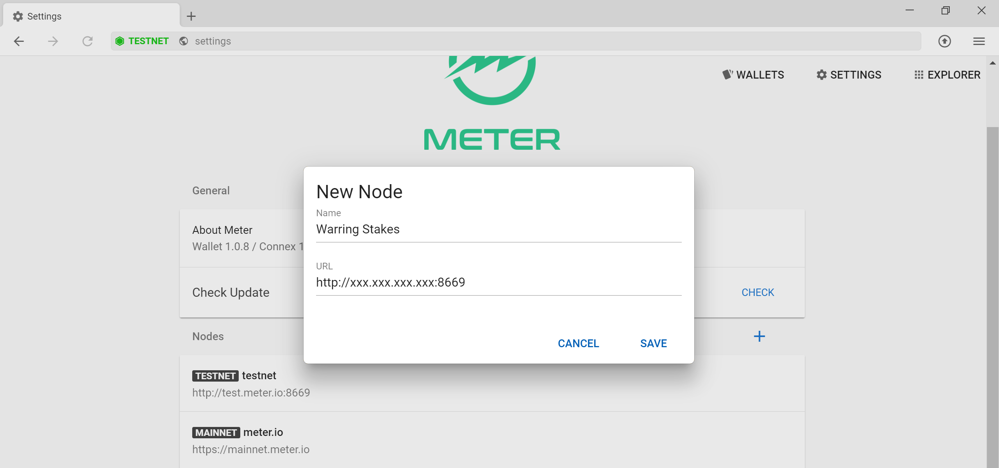
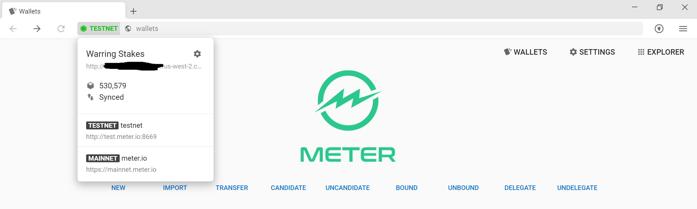

# Warring Stakes Leader Board
| Git Handle           | Points  |
|----------------------|---------|
| huglester            | 7100    |
| dolphintwo           | 3300    |
| bentiancai629        | 2800    |
| includeleec          | 1600    |
| wetezos              | 3400    |
| Tomshi               | 3200    |
| xunppchen (kiwi)     | 3600    |
| rewseRE(noderunners) | 2500    |
| Hashquark-research   | 2300    |
| HeyRoseWu            | 2000    |
| huluyisheng (Wendy)  | 2100    |
| bl-mds(BAM)          | 3700    |
| mstephen5            | 1000    |
| olbk1915(zbx001)     | 1100    |
| sundafa (Nodeasy)    | 3000    |
| r808-m (pupu)        | 1100    |
| usnggogogo(easystake)| 1100    |
| vanguard             | 1200    |
| p2p.org              | 2500    |
| yasyazb(flybird)     | 900     |
| Anthonyhuanggr       | 2900    |
| DokiaCapital         | 1900    |
| Inotel               | 1900    |
| wjdfx(Bit Cat)       | 1700    |
| ercwangwh(ercw)      | 700     |
| tashalin88(Forward)  | 500     |
| TRIXvalidator        | 2400    |
| ssl325               | 2100    |
| isillien             | 2650    |
| blockventure         | 600     |
| seqs                 | 600     |
| wukong               | 1700    |
| erknfe               | 2300    |
| Kunkomu              | 1800    |
| Firestealer          | 1000    |
| FreshMeters          | 1400    |
| zhongbensuan         | 1200    |
| AliceNode            | 200     |
| htabs                | 200     |
| matrixyz             | 1500    |
| nutkab               | 1100    |
| Blue(007)            | 1700    |
| Bruce                | 1100    |
| ZavZav               | 1600    |
| Mars                 | 2000    |
| Wangq                | 200     |
| zwchero              | 800     |
| francz(franktop)     | 1300    |
| Agrestus             | 1600    |
| Alex                 | 1000    |
| driftas(afisport)    | 900     |
| getterlong           | 700     |
| lagrangey            | 700     |
| maximka              | 1300    |
| vip                  | 1600    |
| itokenpool(xudoubles)| 1500    |
| Qiyue                | 800     |
| anonstake.com        | 1000    |
| MindHeartSoul        | 1100    |
| yan08(lee)           | 3800    |
| Pickle               | 1100    |
| aliefaisala          | 400     |
| y2labs               | 400     |
| ractolechoc5(sl-he)  | 200     |
| docpryof(tylerdow)   | 200     |
| villiamsivertsen     | 200     |
| jaroslavrud          | 100     |
| oligarr              | 200     |
| olailsen             | 100     |
| simonhugo(mongeu)    | 200     |
| contabo(mialnaj)     | 100     |
| tommywesley          | 200     |
| felixschulz          | 100     |
| fredrikmalmqvist     | 200     |
| launooskuarttu       | 200     |
| IamS                 | 400     |
| Janliamnilsson       | 200     |
| slsub                | 600     |
| 0ABC                 | 100     |
| agaphone!            | 100     |
| slsub                | 100     |
| GasMeter             | 100     |
| koa                  | 300     |
| merlin               | 200     |
| goto                 | 500     |
| beezneez             | 500     |
| stakin(EdouardLvdl)  | 200     |
| jagon                | 500     |
| BePositiV            | 500     |
| 0ABC                 | 200     |


Social Contributions
| ID                   | Points  |
|----------------------|---------|
| Guilhem              |  50     |
| Griya                |  50     |
| POTsele              |  50     |
| Fabian               |  90     |
| Muhamad Erfan        |  1200   |
| 黄国荣                |  40     |
| 林中白书              |  20     |
| Craig                |  200    |
| Ivy                  |  1000   |
| Blockminer           |  200    |

Developer Contributions
| ID                   | Points  |
|----------------------|---------|
| Skeyili1Liaaeeeyyr   |  500    |

# Instructions for Participating in the Meter Test Net
If you haven't, please complete the complete the [KYC form](https://form.typeform.com/to/BJ9tdMQp) if you want to receive the testnet incentive.  The testnet is however completely permissionless and we welcome any abuses.
If you are running your own validator node, it is highly advised to connect the official Meter Wallet to your own node, so you have the most secure and up to date view of the network. Please also remember to comment on the Github Issue 1 of your validator.  

# Overview
Meter is a hybrid PoW and PoS blockchain system with dual chain structure.  All the accounts and transactions are recorded on the PoS chain while PoW chain (currently a modified version of Bitcoin starting from the same genesis of Bitcoin) just maintains the crypto puzzles for mining. The PoW chain submits the solutions for the crypto puzzles to the PoS chain and the winning miners receive reward on their accounts on the PoS chain.  

Epoch:
Meter operates on epochs, which are signaled by k-blocks (regular blocks are called m-blocks).  At the end of epoch, the committee nodes vote on the longest PoW chain and distribute mining rewards to all the PoW miners, it also pass the information to the PoW chain and all the PoW miners will have to start mining for the stamped PoW block.  To create a k-block, the PoW chain typically has to have more than 60 blocks.  Since the average PoW block period is 1 minute, each epoch is therefore around 1 hour (currently the time for epoch is completely decided by PoW, but we will implement cross interactions for epoch adjustments in the future).  All system financial related activities like reward distribution, entering and exiting the delegate node pool only happens at k-blocks.     

It is also required to run both PoS and PoW processes on the same physical or virtual machine to ensure security.

In Meter, there are several types of full nodes in the network:
1. Regular full node: They sync for each block and can support interactions with wallets
2. Delegate nodes: These nodes are candidates for the committee nodes and have opportunity to propose and sign blocks.  To become a delegate node, the top N (N is a protocol parameter) staked full nodes(including both self staking and votes from other stakers) are the delegate nodes.
3. Committee nodes: A random subset of the delegate nodes are selected for every epoch.  These nodes form a committee quorum and perform consensus.  The committee nodes take turns to propose blocks.  If a proposed block receives endorsement signatures from 2/3 of nodes in the committee, the signatures form a QC (Quorum Certificate).  Each newly proposed block carries QC for the previous block.  Once the newly proposed block obtains a QC, the previous block is considered as confirmed and finalized.

In the test net and initial launch of the main net.  The number of Delegate Nodes will be the same as the number of the committee nodes.  In the future, there maybe a subset of nodes with better performance and network connectivity dedicated as the leaders in the committee nodes.


# Requirements for running a delegate/committee node:
To achieve the full performance of the Meter network, the ideal hardware configuration is more than 8 compute optimized vCPU, 16GB of memory and 500GB of SSD (AWS c5.2xlarge instance or better).  The maximum block size in Meter is around 1.3MB.   However the Meter consensus protocol is capable of adapting to transaction load, network and node processing speed to some extent by varying the block period from 2 sec to up to 30 sec.  The minimum requirement is 2 vCPU and 4GB of memory (a $20~$40/month AWS lightsail nodes). When the network has minimum load, the average monthly block data is expected to be about 1.5GB. We highly recommend the validators to use the same setup as the mainnet.  In addition, please try avoid running nodes behind the country firewalls like the Great Firewall of China.  If your node has connectivity issues with other nodes, it may receive penalty points and get jailed.

# Testnet Incentives
To help validators bootstrap the requirements for validator nodes and properly align the interests, all testnet incentive tokens will be distributed with a 6480 epoch lock(around 270 days).  You could stake these tokens for candidates and votes, but will not be able to send them to other addresses.  Each week of the final warringstakes testnet, we will distribute 15,000 points (1 point = 1 MTRG) and split them among validators who have maintained the nodes properly by weight.  The base weight for each correctly maintained validator node is 1.  If a validator(based on KYC) starts multiple nodes, their weight goes up by 1 for every 2 additional nodes.  To make the game fair for everyone, the maximum weight per KYCed validator will be 3.
Each reported and validated testnet bug may qualify for additional 100 to 500 points depend on its severity.  We target to run the testnet for 2 to 3 weeks before flip the switch to mainnet.  

# Testnet faucets
You could claim testnet tokens from [the testnet faucet](https://faucet-warringstakes.meter.io)

# Setting up Docker
Node software is currently provided as docker images.  Please refer to [Ubuntu Docker Installation Guide](https://phoenixnap.com/kb/how-to-install-docker-on-ubuntu-18-04).

By default, if you installed docker through apt install, it requires root user privilege to run.  However, this may introduce security concerns. It is highly recommended to run Docker as non-root user.

Setup Docker usergroup to run Docker as non-root user.  We assumed the non-root user that will be running docker is "ubuntu", please change the commands accordingly if you are using a different user.
```
sudo groupadd docker
sudo usermod -aG docker ubuntu
```
After this, please logout and log back in to refresh the user group setting and you will be ready to go.

# Setting up a full node

1. Download the latest [desktop wallet](https://meter.io/developers) and make sure you select the warringstakes tesnet.  

2. Prepare host working directory for Meter Docker container
It is recommended to have a host working directory for the container to save important keys and block database, so we could retain them in future upgrades.  We will create a directory called meter-data and set its path to and environment variable called METER_DATA_PATH (you will have to modify accordingly if you have a different directory structure) and map it to the /pos directory inside the container.

(**the following instructions assumes the user operates in $METER_DATA_PATH. Please pay attention to the parameters in the commands and replace the path accordingly to your environment,  especially the path after -v in docker run commands**).  

If your node has run Meter in the past, please make sure to clean the working directory and remove the container with the following commands.
```
rm -rf meter-data
docker container rm -f meter-test
docker container rm -f watchtower
```
Prepare a clean working directory
```
$ mkdir meter-data
$ cd meter-data/
$ echo "export METER_DATA_PATH=$PWD" >> ~/.bashrc
$ source ~/.bashrc
```

3. Launch the Meter container

```
docker pull dfinlab/meter-allin:latest
docker run --network host --name meter --restart always -e NETWORK="warringstakes" -v $METER_DATA_PATH:/pos -d dfinlab/meter-allin:latest
```

Several useful commands for docker:

```
docker container ls -a

```
The output will be like the following:
```
CONTAINER ID        IMAGE                      COMMAND                  CREATED             STATUS              PORTS               NAMES
260bbd571d1a        dfinlab/meter-allin   "/usr/bin/supervisord"   23 hours ago        Up 23 hours                             meter
```
```
docker container stop meter              //stop the container
docker container start meter             //start the container
docker container rm meter                //remove the container
docker image ls
docker image rm [image ID]                   //remove the container image, will trigger redownloading the image at the next docker run, it is recommended to do this every time we upgrade the testnet
docker container exec -it meter bash     //launch a bash in the container
```

The log files can be located inside the container, under /var/log/supervisor directory.  If you file any bugs, please remember to attach the logs for PoS (both the stderr and stdout) in the bug. You could either copy and paste the log or use
```
docker cp meter:/var/log/supervisor/[LogFileNameHere]     //replace with the log file name
```

After confirming the node is running properly through the log, you could then connect the desktop wallet to your own full node.

You could compare the with height with the official [Warring Stakes Testnet Explorer](http://scan.warringstakes.meter.io)

4. Point [Meter desktop wallet](https://meter.io/developers) to your own full node
In the settings of the wallet, under node, you could and connect add your own full node by adding http://IPaddrOfYourNode:8669 .  The icon in the left of the address bar should turn green if everything is running properly.  You could use the explorer inside the wallet to look at the status of the block productions. You should also create an account.  Please make sure you keep the mnemonics in a secure location, you will need them to retrieve your account when we switching between the test nets and it should also work on the future main net.  Please contact a team member to obtain MTRG and MTR test tokens.




# Become a delegate node
Becoming a delegate node requires staking MTRG tokens.  You will have to have both MTR and MTRG tokens in order to perform the transaction.

1. Configure network ports for your node.  It is recommended to have a public IP address if you want to become a delegate node and have the following ports open for inbound TCP connections

| Port Range           | Functions                  |
|----------------------|----------------------------|
| 9209                 | PoW P2P (required)         |
| 8332                 | PoW API                    |
| 8669                 | Wallet REST API            |
| 8670-8671            | PoW/PoS Messages (required)|
| 55555                | Discovery Server           |
| 11235                | PoS P2P (required)         |
| 9100                 | node explorers             |

2. Become a candidate
In the desktop wallet, under the "Candidates" tab, you could self elect to be a candidate for delegate node by staking at least 2000 MTRG tokens and input all the required information for your node.  When filling in the "Candidate" page, you will have to name your validator, put in the IP address of your node, select whether you want to system to automatically participate in the onchain MTRG auction for you (enable autobid) and also submit the public key used to sign the block proposals (this is the BLS key for the node running the validator, you could find the key in $METER_DATA_PATH/public.key file, its corresponding private key is in the master.key file) You could have other accounts delegate their votes to you as well to increase the chance of becoming a delegate node.  The candidate transaction is recorded immediately and the node could start to receive votes.  However, the votes won't be counted until the next k-block even with enough votes.  You could check the list of candidate nodes through http://IPaddrOfYourNode:8669/staking/candidates or inside the wallet.  

The votes for each validator automatically increases at 5% annualized rate to encourage validator to stay in long term. if you uncandidate and recandidate, you will lose these bonus votes.  Whenever you uncandidate and undelegate, it will take one week before the tokens become unbounded and transferrable.

Please be aware that the public.key file in the docker container is generated when the container is launched.  If you start a container from scratch, the public.key will be different from the one you used for the "Candidate" transaction.  You could either "Uncandidate" and "Candidate" again with the new public key or change the public key to the one you used before.

Your node will automatically pick up by our [Meter Scan](https://scan-warringstakes.meter.io/pos) once you successfully become a candidate.  

Please be aware that the candidate transaction require tokens that are not staked.  If you want to make any changes to the candidate information, currently the system requires to wait at least 7 days. In case you made any mistakes, the fastest way maybe to Uncandidate.  After uncandidate, the tokens will still be in locked mode, you could use them to vote your self, but could not use them to candidate yourself.  If you unbound the tokens, it will take 30 days for these tokens to be unlocked.

3. Become a delegate node
If a candidate receives enough votes and ranked in the top N candidate nodes, it will become a delegate node. You could find the list of delegates through http://IPaddrOfYourNode:8669/staking/delegates

# Setting up automatic update for Meter Docker images
1. Backup meter BLS keys
If you look into the meter-data directory, there are three files that are important to keep: delegates.json, master.key and public.key.  In addition, there are also several other files and directories in this folder, we suggest you to delete them on the testnet.  This will cause the database to resync

We have prepared a watchtower container which will automatically check if there is any newly released docker image for Meter and upgrade accordingly.
```
docker run -d --name watchtower --restart always -v /var/run/docker.sock:/var/run/docker.sock containrrr/watchtower --include-stopped --revive-stopped --enable-lifecycle-hooks --interval 10 --cleanup meter
```

# The following steps are not needed if you are running the watchtower
If you prefer to manage the upgrade manually, you could follow the following instructions：

1. Stop and delete the current docker container
```
docker rm -f meter
```

3. Pull the latest meter docker image
```
docker pull dfinlab/meter-allin:latest
```

4. Force Resync block history(Recommended)
```
sudo rm -rf $METER_DATA_PATH/instance-aad99a171ffea4f4
```

5. Start the container and mount the host data backup folder to the pos folder inside the container -v  $METER_DATA_PATH:/pos
```
docker run --network host --name meter --restart always -e NETWORK="warringstakes" -v $METER_DATA_PATH:/pos -d dfinlab/meter-allin:latest
```

# Clean up unused docker images
As we have frequent upgrades in the testnet.  After a while there maybe a lot of unused container images.  You could use the following commnads to remove unused container images
```
docker system prune -af
```
