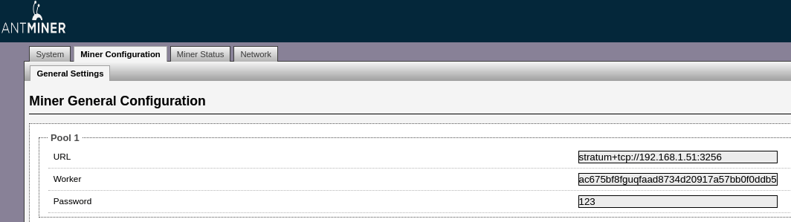

# Meter.io PoW挖矿指南

挖矿不仅仅是创造加密货币的方式，也是获得加密货币奖励的方式。这是一项计算密集型的任务，涉及使用专门的硬件来处理链上区块里的交易，从而获得区块奖励。Meter（MTR）也不例外。

在进行挖矿时，需要考虑许多因素，例如：
挖矿获得加密货币还是购买加密货币会更划算？
应该关注什么类型的区块链，为什么？
如何进行挖矿？举个例子，是自己来做所有的事情，还是和他人合作，还是让别人帮你做？

# 在Meter挖矿需要考虑的因素

每个矿工对于是否要进行挖矿都有自己的理由。例如，在某些情况下，挖矿可能会带来很高的经济收益，而在其他情况下，挖矿的成本可能会变得太高，从而使投资回报率变低。

在挖矿设备方面，所涉及的费用主要包括：矿机设备的费用、以及运行和维护设备所产生的费用。挖矿设备是专用硬件，在前期就需要进行较大资金的投资。并且还设备还需要被放置在拥有有利条件的某个地方，比如，在运行的时候，要使设备运行在低温的条件下。另外，不管设备放在什么地方，电价和挖矿的稳定性都是很重要的因素。

当上面所说的这些可以得以解决时，另外需要考虑的就是回报。

如果挖矿所需的成本是可以控制的，并且挖矿得到的每一个加密货币回报足够高，这就意味着矿工可以得到良好的利润率。

但是，也有可能出现这样的情况：所挖矿的币还没有被积极的进行交易，但可以预期的是，在未来某个时候回报是有利可图的。

Meter的挖矿网络当前还处于测试阶段，但目前在测试网上挖到MTR可以映射到主网，或者可以转换成主网MTRG代币。这为Meter网络早期的矿工提供了很好的动力，使其可以在大批量矿工投入大量的算力进入Meter之前用私有矿池挖矿，可以以更低的成本参与Meter。

## 如何在Meter挖矿？

简单来说，矿工先选择自己的挖矿设备，并通过自己的独立挖矿的获得奖励和回报，或者可以和其他人一起加入一个矿池，然后和他人一起分享挖矿的奖励，获得较为稳定的收益。

每种方式都有其自身的优点和缺点。您可以自己选择最适合自己的方式。

本文档的其他部分，主要为已经拥有比特币挖矿设备，想要在Meter网络进行挖矿的矿工提供信息和帮助。也希望通过在测试网络挖矿的矿工向他们使用的矿池或者云挖矿提供商要求未来对Meter挖矿的支持

## 什么是矿池？

当一群矿工把他们的算力集中在一起共享收益降低风险的时候，就可以称作是一个矿池。一般矿池挖矿的奖励，会根据矿工向矿池贡献的算力比率进行分配挖矿奖励。

矿池可以分为公池和私池。公池往往会收取手续费。

挖矿是完全自愿的，矿工可以根据自己的目标和标准来随时改变他们的算力。例如，因为Meter主网上线的时候支持的是SHA256算法，比特币矿工只需要进行一些很小的配置改变就可以将挖矿设备迁移到支持Meter的矿池中。

## 挖矿硬件设备

因为 Meter 使用和比特币相同的 SHA256 算法，比特币矿工们可以用同样的矿机在比特币和Meter之间切换（只能选一，不是双挖）。


## Meter挖矿

Meter正在积极的和矿池合作支持Meter挖矿。同时我们修改了一个NOMP矿池的开源代码给矿工使用（目前我们还没有在私池代码中加入分账逻辑，所以仅适合一个矿工使用）。本节讲解释如何使配置矿机和该矿池。


以下是在 Meter 测试网络上不同比特币矿机的大致生产参数，以蚂蚁S9矿机为例，挖1个MTR平均需要消耗1度电，在Meter早期测试网上我们设置的是1 MTR = 10度电，我们会在切换的时候为在早期测试网上挖矿的矿工做正确账户余额的转换。另外在主网上线的时候我们会把1 MTR = 1度电标准调整到新型矿机的能耗比水平。从矿工的角度，如果MTR的毛利高于比特币和各种比特币分叉，就值得挖MTR。和挖比特币不同的地方是每天挖到币的数量和全网总体算力的涨跌无关，矿工可以清楚地知道每天能挖到多少个币。

|                      | 功率  | 算力  | 能耗比     | 每天产量   | 利润率指数    |
|----------------------|-------|------|------------|-----------|--------------|
| AntMiner S9          | 1323  | 13.5 | 98         | 31.75     | 1.00         |
| WhatsMiner M10       | 3500  | 55   | 63.64      | 129.36    | 1.54         |
| Inno Silicon T3+ 52T | 2200  | 52   | 42.31      | 79.42     | 2.32         |
| AntMiner S17Pro      | 2094  | 53   | 39.51      | 80.95     | 2.48         |


在测试网上，我们对算力变化的调整速度还相对比较慢。在主网上线前，将会对参数进行调整，来提高响应速度。

### 比特币矿机配置

Meter 采用是类似以太坊的账户系统，而不是比特币的UTXO的系统。这个差异造成在配置的矿机时候需要进行很小的更改。以蚂蚁S9矿机为例，矿工要加入 Meter 矿池，需要在矿机前端的`Miner configuration`中用如下配置：



* `URL`：是制矿池的地址，格式如下
```
stratum+tcp://矿池IP:3256
```
* `Woker`：是 Meter 账户地址（需要把地址前面的0x去掉)
* `Password`：随意设置

### Meter矿池配置

[GitHub](https://github.com/meterio/meter-nomp) 中有为Meter挖矿修改的nomp矿池的开源代码。提供此代码的目的是为了显示与标准的比特币矿池相比所需的更改，便于未来商业矿池的支持。

运行要求

运行Meter nomp 矿池需要三个组件：Node.js, 一个数据库（Redis或MySQL）,以及与Meter网络上一个coin daemon 的连接，coin daemon是任意一个Meter网络的全节点，接入Meter的PoW和PoS的P2P网络

在测试网环境中，可以使用Meter团队的coin daemon。通常情况下，矿池的运营者应该设置矿池自己的coin daemon。

以下是 Node.js 和 Redis的最低版本要求，如果使用比以下版本更旧的版本，有可能会出现一些问题：

* [Node.js](http://nodejs.org/) v0.10+ ([英文安装指南](https://tecadmin.net/install-nodejs-with-nvm/#))
* [Redis](http://redis.io/) v2.6+ ([英文安装指南](http://redis.io/topics/quickstart))

在Ubuntu Linux中，您可以用下面的命令来安装 nodejs 和 Redis：
```bash
sudo apt install npm
sudo apt install nodejs
sudo apt install redis
```

**重要提示！** 安全运行 nomp 的一项重要配置是保证数据库的安全，禁止从外部直接访问nomp的数据库Redis，一种简单方法是：

在你的 redis.conf 文件中加入`bind 127.0.0.1`,并给服务器配置有比较严格规则的防火墙，只允许本地访问 Redis。更多相关的信息，可以阅读[Redis安全](http://redis.io/topics/security)文档。还有个可以找到更多Redis安全配置的地方是[Data Persistence](http://redis.io/topics/persistence)。

下载和安装nomp矿池软件：

```bash
git clone https://github.com/meterio/meter-nomp.git
cd meter-nomp
npm update
npm install
```

### 配置端口

在`config_example.json`文件中，确保默认配置适用于您的环境，然后将文件复制到`config.json`中。

```js
"redis": {
    "host": "127.0.0.1",
    "port": 6379
}
```

### 挖矿种类配置

在`coins`目录中，确保有个json文件有以下内容：

```js
{
    "name": "Meter",
    "symbol": "MTR",
    "algorithm": "sha256",
}
```

### 矿池配置

矿池的配置文件是`pool_configs`的目录里`meter.json`。确保在此文件中配置适当的字段，尤其是`rewardBeneficiary` 和 `daemon`/`daemons` 的配置。

在下面这个例子中，矿池所有者的 Meter地址是`0a05c2d862ca051010698b69b54278cbaf945ccb`，（需要去掉Meter地址前的0x）`rewardBeneficiary` 应配置成该地址，系统会把出块奖励发送到该地址。另外还需配置矿池连接的coin daemon（Meter全节点），在测试网上，可以选用一个我们设置的全节点（n01.meter.io）。

daemon 的部分程序中的 Meter 值应该配置如下：
```js

    ...

    "rewardBeneficiary": "867a4314d877f5be69048f65cf68ebc6f70fc639",

    ...

    "daemons": [
        {
            "host": "n01.meter.io",
            "port": 8332,
            "user": "testuser",
            "password": "testpass"
        }
    ],

    ...

```
在 Meter 网络的Nomp当前提供的部分的功能状态下,`meter.json`中的很多其他的字段可以暂时忽略。

启动端口

在所有的文件中包含的的配置方式都被设置完成之后，您就可以启动矿池了。

如果所有的内容都是本地安装在主机上，请使用以下命令启动：

```bash
$ node init.js
```
启动后，矿池应该已经可以开始运行了，我们可以从日志和 http://矿池IP:8088/stats 中查看矿池的状态信息。
